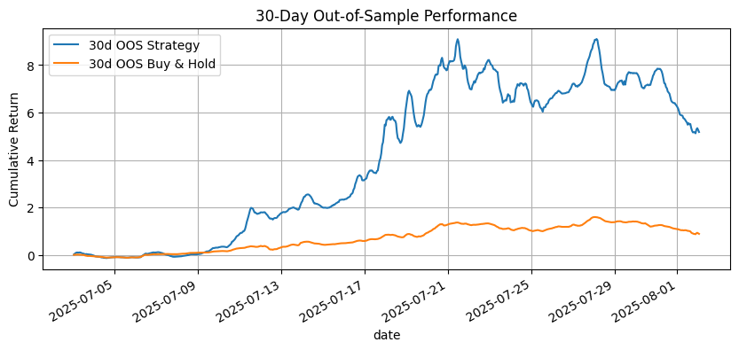

# Equity Signal Framework
Systematic, leakage-safe equity return forecasting with reproducible out-of-sample validation.

[](https://colab.research.google.com/github/niveth-n/equity-signal-framework/blob/main/notebooks/archival_results.ipynb)
[](https://colab.research.google.com/github/niveth-n/equity-signal-framework/blob/main/notebooks/run_demo.ipynb)
[](LICENSE)

> Educational research project; not investment advice.

## At a glance
**Archival (full pipeline):** 30-day OOS **517.99%** vs **88.83%** buy-&-hold • CV/OOF **61.25%** (N≈293,905; 95% MoE ±0.18%).  
*Files in `results/archival/`. Full pipeline code is private for IP hygiene; available to admissions/faculty on request.*

**Public demo (reproducible):** **OOS 2025-07-01 → 2025-07-31** • **Acc 50.00%** • **Precision 42.66%** • **Sharpe −2.10** • **Max DD 2.28%** • **Turnover 0.25**.  
*See `results/oos_metrics.csv` and plots in `results/plots/`.*

---

## What this is
A focused framework to model short-horizon **direction** of equity returns. The repo ships:
- A **read-only archival notebook** that displays the strongest previously validated results (no re-running, numbers are fixed).
- A **minimal runnable demo** (small baseline model) to show methodology and reproducibility.

## Data (full pipeline — multi-asset)
- **Universe (26):**
  - **FX majors (7):** EURUSD, GBPUSD, USDJPY, USDCHF, AUDUSD, USDCAD, NZDUSD
  - **FX minors (6):** EURGBP, EURJPY, GBPJPY, AUDJPY, CADJPY, CHFJPY
  - **Crypto (5):** BTCUSD, ETHUSD, SOLUSD, BNBUSD, XRPUSD
  - **Commodities (8):** XAUUSD (Gold), XAGUSD (Silver), WTI/USOIL, Brent/UKOIL, NG (NatGas), HG (Copper), XPTUSD (Platinum), XPDUSD (Palladium)
  *Symbols may vary by data provider; mapping provided in the private stack.*
- **Train/Val window:** **2024-01-01 → 2025-06-30**  
  (last ~60 trading days used as the validation slice)
- **OOS (archival):** **2025-07-01 → 2025-08-01**
- **Frequency:** Daily bars. FX/commodities snapped at **NY 5 pm ET**; crypto at **00:00 UTC**; all series resampled onto a common daily calendar.
- **Fields used:** Adjusted **Open, High, Low, Close, Volume** (or tick volume where volume is unavailable).
- **Cleaning & warm-up:**  
  Require ≥ **60** bars history before first label; drop rows with missing O/H/L/C; align to trading calendar; keep delist dates (no survivorship in OOS).
- **Execution & costs:** **next-bar close**; demo uses uniform **fees=2 bps**, **slippage=5 bps**. (Full pipeline uses per-asset assumptions.)

## Feature engineering (full pipeline)
All features use information available **at or before t** (no look-ahead).  
We standardize within-asset and cross-sectionally per date; winsorize at 1st/99th percentiles.

- **Price/return:** r1 (1-day), **mom_5/10/20**, **ma_ratio_10/20**, **mean_rev_5** (z-score of r1).
- **Volatility & range:** **vol_20** (std of r1), **atr_14_pct**, **vol_of_vol_5**.
- **Session/microstructure:** **gap_open** (O(t)/(C(t-1)−1), **hi_lo_range**, **close_loc** (close within day range).
- **Volume/liquidity:** **volu_z20** (z-score vs 20-day mean), **adv_pct** (dollar vol ÷ 20-day ADV; proxy where needed).
- **Cross-sectional (per date):** **mom_20_cs**, **reversal_1d_cs**, **vol_20_cs** (z-scores/ranks across the 26 instruments).
- **Market/regime context:** **mkt_ret_20 / mkt_vol_20** (broad-market proxy like DXY/SPY), **breadth_ma50** (% above MA50), **dow_onehot** (calendar).

## Leakage & validation guardrails
- Features at **t** never use info from **t+1** or later; label predicts **t+1**.  
- **Blocked/rolling CV** with **OOF** predictions for stacking; final **OOS** held out untouched.  
- Backtests include costs; sizing = **equal-weight top-K (K=5)** by predicted probability; **daily rebalance**; **max gross leverage = 1.0**.

## Data & features (demo)
- **Scope:** U.S. equities (sampled), daily close prices.
- **Features:** 1-day return, 5-day momentum, 20-day volatility, 10-day MA ratio, cross-sectional z-score.
- **Target:** next-day return sign (`y ∈ {0,1}`).
- **Guards:** no future bars; time-blocked splits; final OOS kept untouched.

## Method
- **Archival (full pipeline):** stacked learners with out-of-fold meta-model; OOS-first design; explicit fees/slippage.
- **Public demo:** simple classifier, equal-weight top-K, **next-bar close** execution, commission=2 bps, slippage=5 bps, daily rebalance, K=5, max gross lev=1.0.

## Results

### Archival (full pipeline)
- **CV/OOF:** 61.25% (N≈293,905; 95% MoE ±0.18%).  
- **OOS (30-day):** **2025-07-01 → 2025-08-01** — Strategy **517.99%** vs Buy-&-Hold **88.83%**.  
- Files:  
  - CSVs: `results/archival/cv_report.csv`, `results/archival/oos_30d_metrics.csv`  
  - Plots: `results/archival/equity_curve.png`, `results/archival/confusion_matrix.png` (if available)  
  - Config: `results/archival/backtest_config.yaml`  
- *Full pipeline code available to admissions/faculty on request.*



### Public demo (reproducible)
- **Dates:** 2025-07-01 → 2025-07-31  
- **Accuracy:** 50.00% • **Precision:** 42.66% • **Recall:** 52.14% • **F1:** 46.92%  
- **Sharpe:** −2.10 • **Max DD:** 2.28% • **Turnover:** 0.25  
- **Returns:** Strategy **−1.67%** • Buy-&-Hold **−0.94%**  
- Files: `results/oos_metrics.csv`, plots in `results/plots/`.

---

## Reproduce (demo)
**One-click:** use the “Run Demo” Colab badge above.  

**Local CLI:**
```bash
python -m src.backtest --config evidence/backtest_config.yaml
